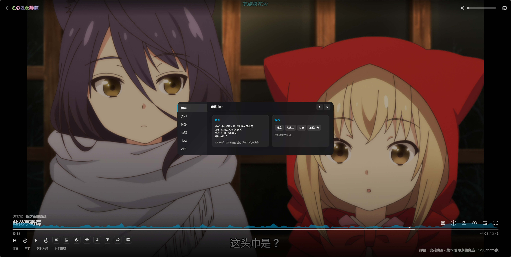

<h1 align="center">Emby Danmaku Extension (dd-danmaku)</h1>
<p align="center">弹幕获取 · 智能匹配 · 过滤/热度/密度分析 · 外观与布局快速调节 · 缓存与日志</p>

<p align="center">
<strong>当前版本：2.0</strong>
</p>

---

## 演示



## 功能特性

| 类别 | 功能 | 说明 |
|------|------|------|
| 匹配 | 自动/手动匹配 + 原标题回退 | 中文搜不到时自动尝试 OriginalTitle |
| 数据 | 弹弹play 聚合 + 本地缓存 | 评论与搜索缓存（可开关、TTL）支持压缩 |
| 渲染 | Canvas 引擎 + 自定义速度 | 速度、字体、透明度即时调整 |
| 过滤 | 等级过滤 (0–4) + 类型 + 关键词 + emoji | 开关/滑块秒级重建，无刷新 |
| 自适应 | 弹幕高峰自动临时提高过滤与减速 | 5 秒节奏检测，条件恢复 |
| 分析 | 顶部实时密度曲线 + 独立热度图窗口 | 可悬停预览/点击跳转时间 |
| 外观 | 快速外观面板 + 统一“弹幕中心” | 一键集中管理所有模块 |
| 布局 | 外显按钮选择 + 拖拽排序 + 紧凑模式 | 立即生效，支持恢复默认 |
| 日志 | 调试日志 / CORS 测试 / 缓存清理 | 便于排障与反馈 |
| 其他 | 简繁转换 (原/简/繁) | 与获取接口联动 |

## 截图


<!-- 如果还有更多，继续按顺序添加；将截图1.png 等替换为真实文件名 -->

## 安装方式

任选其一：

### 1. 服务端嵌入（Docker / 裸机）

编辑 `/system/dashboard-ui/index.html`，在 `</body>` 前加入：

```html
<script src="https://cdn.jsdelivr.net/gh/kumu-ze/dd-danmaku@master/ede.js" defer></script>
```

### 2. 浏览器用户脚本（Tampermonkey 等）

复制 `ede.js` 内容新建脚本；或引用 RAW：

```html
// @require https://raw.githubusercontent.com/kumu-ze/dd-danmaku/master/ede.js
```

### 3. 客户端打包修改

解包 -> 修改 `dashboard-ui/index.html` -> 重新签名/打包。iOS 可用 AltStore / TrollStore，自行检索具体流程。

> 服务端与用户脚本方式可同时存在；用户脚本优先生效。

## 使用说明概览

| 入口 | 作用 |
|------|------|
| 弹幕开关 | 显示 / 隐藏弹幕（保留实例） |
| 过滤等级 | 循环 0–4；0 关闭，>0 有并发/垂直密度限制 |
| 弹幕设置 | 快速外观：字体 / 不透明 / 速度 / 热度轨迹 |
| 弹幕中心 | 全部高级配置（外观 / 过滤 / 布局 / 高级） |
| 搜索 | 手动匹配：支持原标题按钮 & 自动回退逻辑 |
| 热度图 | 独立对话框；柱状 + 平滑线；点击跳转 |
| 日志 | 调试信息、CORS 测试、缓存管理、按钮排序 |

快捷键：

* Alt + H ：打开/关闭热度图

## 过滤系统说明

* 等级 (0–4)：限制时间片内弹幕量，并对高密度窗口动态调整。
* 类型过滤：顶部 / 底部 / 滚动 / 彩色 / emoji。
* 关键词：大小写不敏感；立即生效。
* Emoji 过滤：安全 fallback 正则，避免崩溃。

## 缓存策略

| 类型 | Key 前缀 | TTL | 说明 |
|------|----------|-----|------|
| 搜索 | `_search_cache_` | 24h | 命中显示“使用缓存结果” |
| 弹幕 | `_danmaku_cache_` | 1h (压缩) | LZString Base64，自恢复 |

可在日志面板关闭或清除。

## 常见问题 (FAQ)

**Q: 匹配不到？** 先看日志是否显示“自动匹配失败”；尝试搜索界面切换“原标题”再搜。
**Q: 过滤等级改了没变化？** 等级>0 才生效；确认顶部过滤按钮图标变化；若仍旧 -> 日志查看原始/当前弹幕数。
**Q: 热度曲线不显示？** 可能被关闭：外观开关“热度轨迹”；或当前弹幕为空。

## 版本历史（节选）

### 2.0

* 重构：核心逻辑与 UI 结构按 2.0 规划整理（请补充实际改动点）。
* 新：请在此填写 2.0 的新增功能要点。
* 优化：请在此填写主要性能/体验改进。
* 修复：请在此填写重要修复。

### 1.0.15.4

* 新：快速外观面板重制（实时数值 / 现代 UI）。
* 新：“布局”页内置拖拽排序 + 默认恢复。
* 调整：脚本元数据精简规范；弹幕中心标题去除“层级”。
* 优化：过滤按钮图标同步更新逻辑。

### 1.0.15.2

* 去除多余等待 / 防抖；修复排序偶发失效。

### 1.0.14 – 1.0.13.x（概述）

* 弹幕设置面板、关键词过滤、按钮自定义、缓存、自动匹配改进、UI 现代化、性能/日志优化。

更早版本：首次信息展示 / 高级过滤 / 原标题搜索增强等。

## 数据与隐私

所有匹配缓存、设置、过滤词存储于浏览器 `localStorage`；不向第三方回传。API 仅访问所选代理 + 弹弹 play。

## 致谢 / 引用

| 项目 | 贡献 | 协议 |
|------|------|------|
| 9channel/dd-danmaku | 初始实现思路 | MIT |
| chen3861229/dd-danmaku | 高级过滤 & UI 改进 | MIT |
| hiback/emby-danmaku | 透明度控制等代码片段 | MIT |

## 许可

MIT License. 贡献请提交 PR / Issue。


